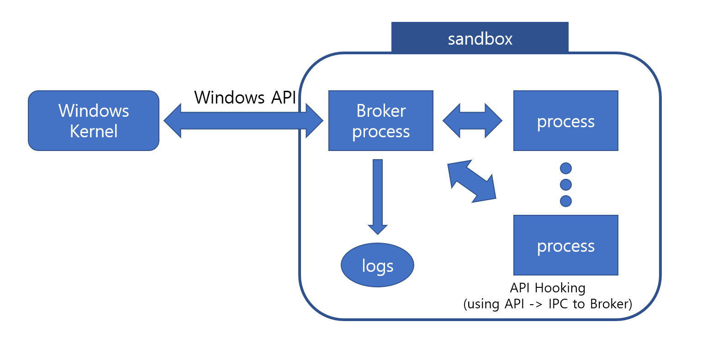

# Windows Process Sandbox

## ABSTRACT

## IDEA

The core idea is that, when you run a process in sandbox environment, it runs at low integrity and it uses Windows API by communicating, IPC, with the broker process. When the broker received the request, it logs the request and proceed it.

There are special cases when processing. Files and registries are isolated from normal environment. There is designated location for isolated processes. The broker process makes it look like a normal environment.

Also you can emulate Windows API by logs. It reads the logs in the specified order and shows them as if they were working properly. Or You can just restrict certain interfaces to protect your system.

## Elements

- Sandbox manager
- Broker Process
- Log manager
- IPC manager
- API Hooking DLL
- DLL injector

## Possible Usage

- Run a process in isolated environment
- Automated test
- Run malwares securely

## Current Working

- Apply Windows App-Container